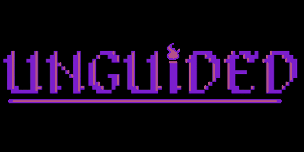
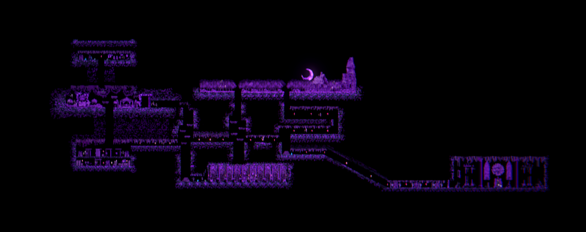

# Unguided

Unguided is a 2D platformer metroidvania game inspired by the gameplay style of Hollow Knight and Ruin Valley and the artstyle of old retro games. It follows a masked adventurer clearing a dungeon before facing off against the nameless king of a long fallen kingdom. 

We made Unguided as a project for school in a 7 day time frame with no experience in game development using Unity and almost no experience in game development in general. Inspite of our inexpertise, we believe we were able to create a modest game in the time frame we got. However, due to the time limitations, we were not able to perfect all the systems in the game and since we were in constant development rush in a development environment we were unacquainted with, some bugs and glitches may pop up.

As a side note, *most* art assets used in the game were made by our own artists including all of the character sprites as well as background assets present in the game.

If you like our project, consider giving us a star on GitHub. Your support means a lot to us.
 
## Table of Contents
- [Features](#features)
- [Requirements and Installation](#minimum-requirements-and-installation)
- [Credits](#credits)

## Features
Unguided is primarily a platformer game and the map layout has been made beautifully interconnected with that in mind. The overall direction of the player's progression is somewhat linear in that the player will end up at the same room containing the nameless king regardless of the places they choose to explore first.

The movement in the game has been kept intentionally simple allowing the player to use jumps, double jumps, dashes and wall-climbing along with running as means of transverse the dungeon.

In the classical fashion of Souls(-like) games, the player is able to rest at bonfires to heal up and save the last rested bonfire as a checkpoint.

Another important aspect of the game is the combat. The player has access to combo attacks, along with a special attack that trades off time for explosive AOE damage. 

And of course, what would a game like unguided be if not without a boss.

## Requirements and Installation
The game is very lightweight and will work smoothly on any version of Windows 10 and 11 (x86/x64). However, Unguided is **NOT** supported in ARM architecture computers yet.

To try out the game, just download [unguided-win64.rar](https://github.com/sh4dman23/unguided-game/releases/latest) from the releases page if you are using a 64 bit system or download [unguided-win32.rar](https://github.com/sh4dman23/unguided-game/releases/latest) if you are on a 32 bit system. Unzip the rar after downloading it and run the game by starting "UNGUIDED.exe". The game may take a while to load on the first boot while it sets up required dependencies.

**Please note that the game does not have an UI yet. To close the game, please press `alt` and `f4` keys together on your keyboard. `alt + f4` is a common way to exit any program running on the foreground. To get out of the game without closing it, press `alt` and `tab` keys together.**

## Credits
As previously stated, Unguided was made as a school project by 6 people. You can find information of the developers of Unguided below:
- Ahmed Thousif
    - Lead Programmer
    - [Github](https://github.com/DevThousif) | [Instagram](https://www.instagram.com/th0us1f)
- Arham Saleh Chowdhury
    - Character Artist | Animator
    - [Github](https://github.com/Ardisif1) | [Instagram](https://www.instagram.com/arham_saleh_chy)
- Saif Barakat Chowdhury
    - Programmer | Layout Designer
    - [Github](https://github.com/Saifbarakat) | [Instagram](https://www.instagram.com/_saifbarakat_)
- Shadman Shahab
    - Lead Programmer
    - [Github](https://github.com/sh4dman23) | [Instagram](https://www.instagram.com/sh4dman__)
- Shahir Ahmed Chowdhury
    - Environment & Asset Artist
    - [Github](https://github.com/KanjiOhitsu) | [Instagram](https://www.instagram.com/shahir.chy)
- Vivek Anand Singha
    - Editor | GUI & SFX Artist
    - [Github](https://github.com/malviv) | [Instagram](https://www.instagram.com/visuals.malviv) | [Fiverr]()

Since we didn't have a music artist in our team, we decided to use music made by other wonderful artists. Their music have been credited below: 
- [Gymnopédie No. 1](https://www.youtube.com/watch?v=eMnxjdGTK4w) by [Erik Satie](https://www.youtube.com/channel/UCUROzjdfvV996Ow-GqUGsUw)
- [BATTLE UNDER A BROKEN SKY](https://www.youtube.com/watch?v=1XGIl2pONm0) by [AZALI](https://www.youtube.com/@AZALI00013)
